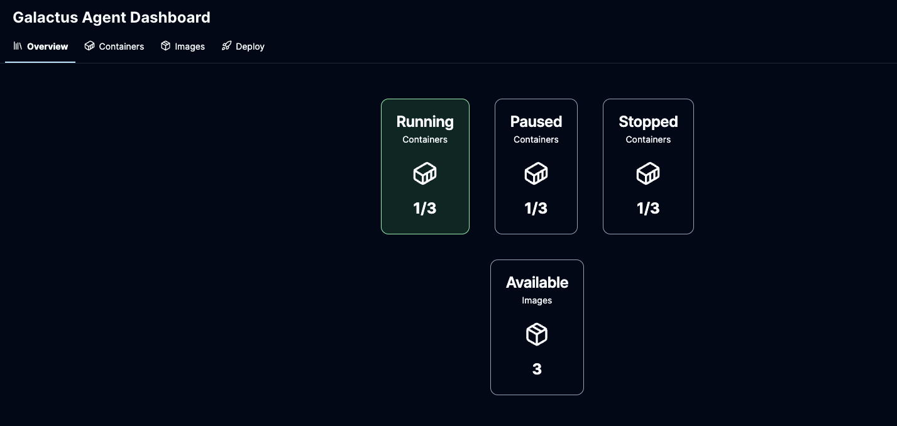
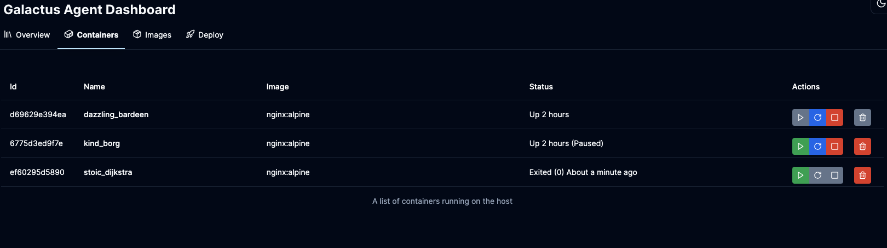
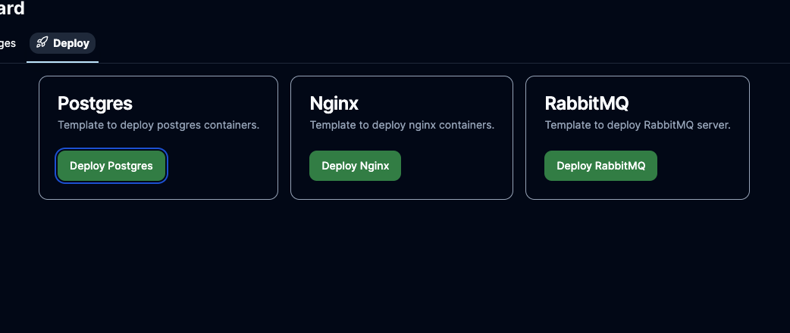
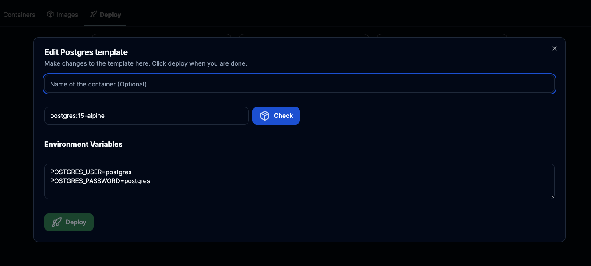

<!--  -->

### My Open Source Projects
- [Galactus Agent](https://github.com/mubashiroliyantakath/galactus-agent)

    Easy to use and self hosted docker container manager. Inspired by [Portainer](https://www.portainer.io/) and [Dockge](https://dockge.kuma.pet/)

    Stack: `NextJS`/`Go`/`Docker`

       
- [Docker Metadata Action for GitLab](https://gitlab.com/devletix/devops/docker-metadata-action)

  Plug-and-play tool for GitLab CI/CD inspired by [Docker Metadata Action](https://github.com/marketplace/actions/docker-metadata-action)

  Stack: `Go`
